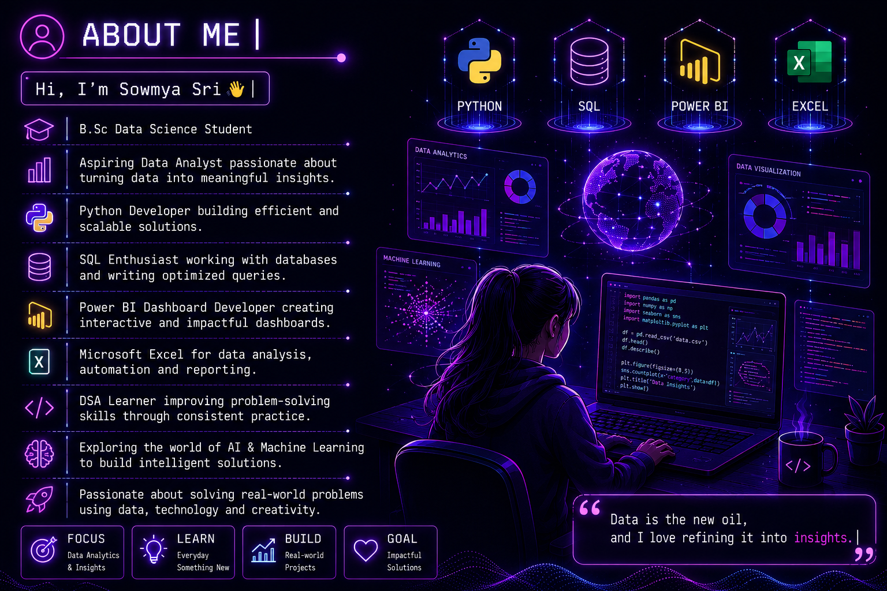

<p align="center">
  
</p>

<p align="center">


</p>

<p align="center">

</p>

<h1 align="center">Hi 👋 I'm Sowmya Sri</h1>

<h3 align="center">
📊 Aspiring Data Analyst • 🎓 B.Sc Data Science Student
</h3>

<p align="center">


</p>

---

# 👩‍💻 About Me

<p align="center">


</p>

- 🎓 Final Year B.Sc Data Science Student
- 📊 Passionate about Data Analytics & Business Intelligence
- 🐍 Python | SQL | Power BI | Excel
- 🤖 Exploring Machine Learning & AI
- 💻 Solving DSA Problems Daily
- 🚀 Building Real-World Projects
- 🌱 Currently learning Advanced Data Analytics

<p align="center">



</p>

---

# 🚀 Tech Stack

<p align="center">


<br><br>


</p>

---

# 🚀 Featured Projects

| Project | Tech |
|---------|------|
| 🤖 AI Resume Portfolio Generator | Python • Flask • HTML • CSS |
| 📊 Netflix Data Analysis Dashboard | Python • Pandas • Power BI |
| 🌌 Hand Gesture Particle Sphere | Three.js • JavaScript • MediaPipe |

---

# 📊 GitHub Stats

<p align="center">


</p>

<p align="center">


</p>

---

# 🔥 GitHub Streak

<p align="center">


</p>

<p align="center">


</p>

---

# 📈 GitHub Activity Graph

<p align="center">


</p>

---

# 🏆 GitHub Trophies

<p align="center">


</p>

---

# 🧠 Skills Progress

```text
Python              █████████░░ 90%
SQL                 ████████░░░ 80%
Power BI            ███████░░░░ 75%
Excel               ███████░░░░ 75%
Machine Learning    ██████░░░░░ 60%
DSA                 ███████░░░░ 70%
```

---

# 💼 Current Focus

- 📊 Data Analytics
- 📈 Power BI Dashboards
- 🐍 Python Projects
- 🗄 SQL Practice
- 💻 Data Structures & Algorithms
- 🤖 AI & Machine Learning
- 📑 Excel Automation

---

# 🎯 2026 Goals

- ✅ Master Python
- ✅ Master SQL
- ✅ Build 20+ Data Analytics Projects
- ✅ Learn Machine Learning
- ✅ Solve 300+ DSA Problems
- ✅ Crack a Top Tech Company

---

# 💬 Random Dev Quote

<p align="center">


</p>

---

# 🌐 Connect With Me

<p align="center">

<a href="https://www.linkedin.com/in/prasanna-shanmukha-sowmya-sri-vadlamuri-a0ab45340">

</a>

<a href="mailto:sowmyasree173@gmail.com">

</a>

<a href="https://github.com/Sowmyaaa17">

</a>

</p>

---

# 🐍 Contribution Snake

<p align="center">


</p>

---

<p align="center">

<h2>💜 Thanks for Visiting My Profile 💜</h2>

⭐ If you like my work, consider giving a ⭐ to my repositories.


</p>
